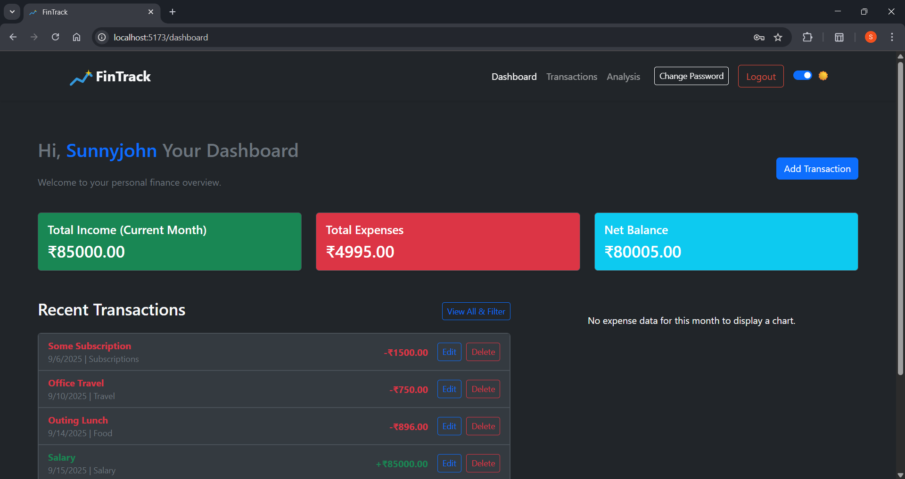
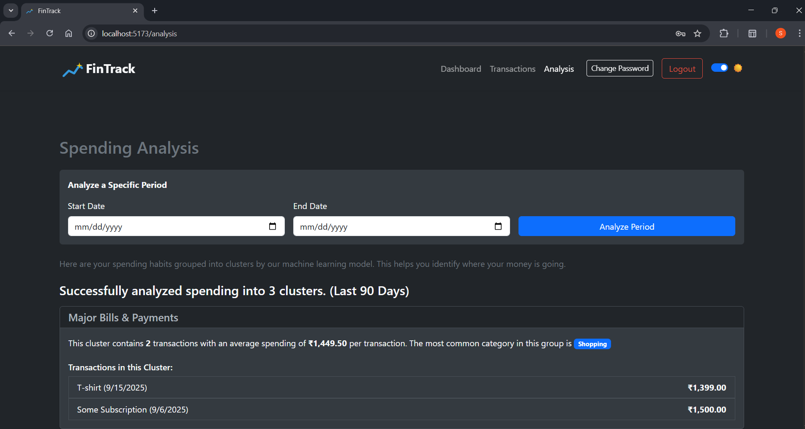
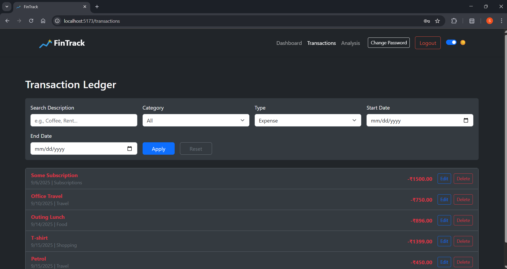
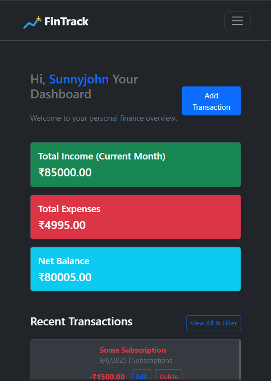
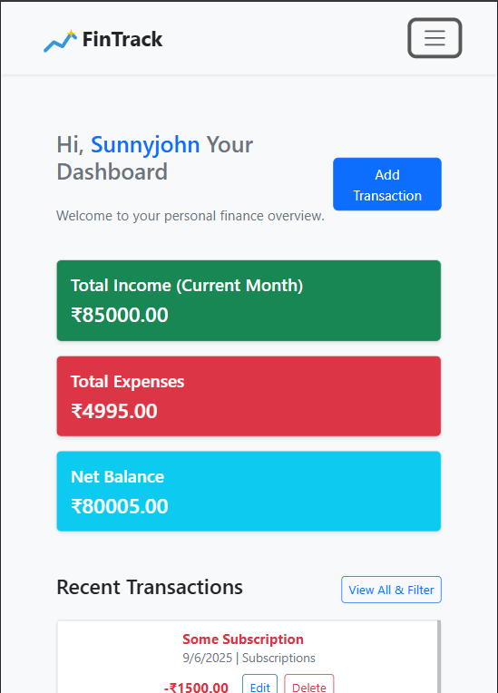
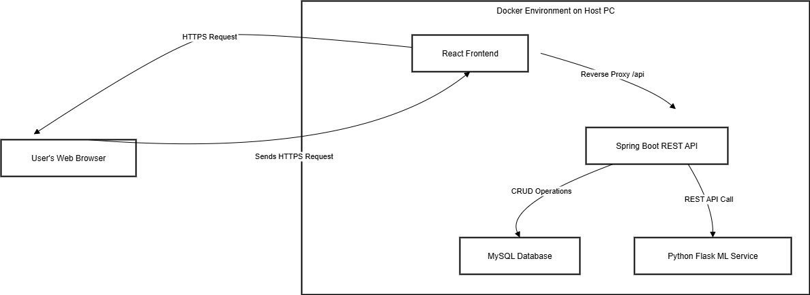

# 🏦 Personal Finance Tracker with ML Insights

A full-stack, microservice-based application for intelligent financial management, featuring a Spring Boot backend, a Python ML service, and a React frontend.

[](https://opensource.org/licenses/MIT) [](https://www.java.com) [](https://spring.io/projects/spring-boot) [](https://reactjs.org) [](https://www.python.org) [](https://www.docker.com)

This project is a comprehensive personal finance dashboard designed to provide users not just with transaction tracking, but with actionable, data-driven insights into their spending habits. By leveraging an unsupervised machine learning model, the application automatically discovers and presents spending patterns, helping users understand their finances on a deeper level.

**Live Demo:** `[Link to your deployed application if available]`

---

## ✨ Key Features

This application is more than a simple CRUD app; it's a suite of tools for financial analysis.

| Feature                      | Description                                                                                                                                                       | Status      |
| ---------------------------- | ----------------------------------------------------------------------------------------------------------------------------------------------------------------- | ----------- |
| **Secure JWT Authentication**    | End-to-end secure user registration and login flow using JSON Web Tokens, with graceful handling of token expiration.                                             | ✅ Complete |
| **Interactive Dashboard**      | A central hub with real-time summary cards (income, expenses, balance) and a dynamic chart visualizing spending by category.                                      | ✅ Complete |
| **Full Transaction Management** | Complete CRUD (Create, Read, Update, Delete) functionality for transactions, featuring a "smart" category selector to streamline data entry.                      | ✅ Complete |
| **Advanced Filtering & Search**  | A dedicated "Transaction Ledger" page with robust, server-side filtering by date range, type, category, and description, including pagination.                      | ✅ Complete |
| **ML-Powered Analysis**        | An "Analysis" page that uses a Python **K-Means Clustering** model to automatically group spending into meaningful clusters, like "Major Bills" or "Daily Expenses". | ✅ Complete |
| **Dynamic Model Tuning**       | The ML service uses the **Elbow Method** to programmatically determine the optimal number of spending clusters, tailoring the analysis to each user's unique data.  | ✅ Complete |
| **Responsive UI with Dark Mode** | The entire application is fully responsive and includes a persistent, user-toggleable light/dark theme for an excellent user experience on any device.             | ✅ Complete |
| **Containerized Deployment**   | The entire multi-service application is orchestrated with **Docker Compose**, ensuring a consistent, one-command setup for development and deployment.                 | ✅ Complete |

---

## 📸 Application Showcase

### 1. The Interactive Dashboard
*The central hub for users, providing an immediate overview of their financial health for the current month.*



### 2. ML-Powered Spending Analysis
*This is the core intelligent feature. The application analyzes transaction data and presents automatically discovered spending clusters, helping users identify where their money truly goes.*



### 3. Advanced Transaction Filtering
*A dedicated page for power users to deep-dive into their transaction history with multiple filters.*



### 4. Responsive Mobile View & Dark Mode
*The application is designed to be fully functional and visually appealing on any device, respecting user preferences for dark or light themes.*


|  |  |
|:------------------------------:|:-------------------------------:|
|       Dark Mode (Mobile)       |       Light Mode (Mobile)       |

---

## 🏗️ System Architecture

This project is built on a modern **microservice architecture**. This design separates concerns, improves scalability, and allows for the use of the best technology for each specific task (Java for the robust backend, Python for data science).



- **React Frontend**: A client-side application built with React and served via a lightweight Nginx server. It is responsible for the entire user interface.
- **Spring Boot Backend**: The core of the application. This robust REST API handles user authentication, business logic, and data persistence. It acts as an orchestrator, fetching data from the database and delegating analysis tasks to the ML service.
- **Python ML Service**: A specialized Flask microservice that exposes a single endpoint for data analysis. It receives transaction data, performs K-Means clustering, and returns structured insights.
- **MySQL Database**: The persistent storage layer for all user and transaction data.

---

## 🚀 Running Locally with Docker

This entire application stack can be built and run with a single command, thanks to Docker Compose.

### Prerequisites
- Docker & Docker Compose
- Git
- A `.env` file in the root directory (see `.env.example`)

### Steps

#### Clone the repository:
```bash
  git clone https://github.com/[YourUsername]/[YourRepoName].git
  cd [YourRepoName]
```

#### Create your environment file:
Create a `.env` file in the root of the project and add your secrets:

**.env**
```env
DB_PASSWORD=your_super_secret_database_password
JWT_SECRET=your_long_and_random_jwt_secret_key
SPRING_DATABASE_URL=your_spring_database_url
DB_USERNAME=your_super_database_username
ML_URL=your_customized_ml_url
```

#### Build and run the application:
```bash
  docker-compose up --build
```

#### Access the application:
- **Frontend:** `http://localhost:5173`
- **Backend API:** `http://localhost:8282`

The application will start with all services networked and configured to work together.

---

## 💡 What I Learned
Building this project was a fantastic learning experience that solidified my skills across the full development lifecycle:

- **Complex Backend Architecture:** I learned to design and build a secure, stateless REST API with Spring Boot, implementing token-based authentication (JWT) and advanced, dynamic querying with the JPA Criteria API.
- **Microservice Integration:** I gained hands-on experience in building and orchestrating a multi-service application, making a Java backend communicate seamlessly with a Python service.
- **Practical Machine Learning:** I moved beyond theory and implemented an end-to-end unsupervised learning pipeline, including feature engineering, model tuning (Elbow Method), and, most importantly, interpreting the model's output into user-friendly insights.
- **Professional Frontend Development:** I built a responsive, interactive, and themeable UI in React, managing complex state and asynchronous operations.
- **DevOps & Containerization:** I learned to containerize a multi-language application using Docker and orchestrate the entire stack with Docker Compose, creating a portable and reproducible development environment.

---

## 📞 Contact

**Sunny John Balla**  
🔗 [LinkedIn Profile](https://www.linkedin.com/in/sunnyjohnballa21/)  
📧 [sunnyjohnballa@gmail.com](mailto:sunnyjohnballa@gmail.com)